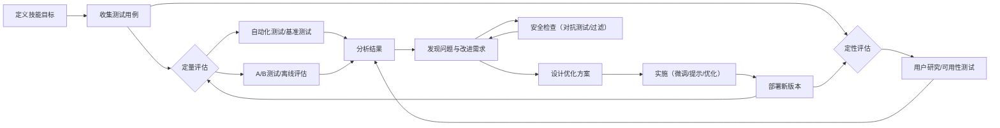

# 执行摘要  
本文系统梳理了现代 AI 工程团队（如 OpenAI、Anthropic）在设计与迭代「技能」（Skill）功能时的评估与优化方法。首先明确「技能」的定义与作用，再列举**评估目标**（准确性、鲁棒性、可用性、安全性、成本、延迟、可解释性、可维护性等）并分别阐述其意义与关注指标。然后分别讨论**定量评估**（自动化测试、基准测试、A/B 测试、离线/在线指标、置信度校准、误差分析等）和**定性评估**（用户研究、可用性测试、反馈循环等）的方法、优缺点及适用场景。接着介绍**安全与滥用检测**（对抗性测试、内容过滤、红队审计等）策略。**优化流程**方面，涵盖了数据采集与标注、模型微调、提示工程，以及工具链/CI/CD、自动化回归测试、持续监控等实践。还总结了**工程实践与组织流程**（团队角色分工、评审流程、SLO/SLI、版本管理等）和常见**案例与工具**（官方方法、开源框架、第三方平台）。最后提出**实验设计与统计方法**以衡量改进效果，给出了评估指标和监控仪表盘指标的建议，以及示例阈值和告警规则。全文结合了官方文档和技术文章，提供操作性检查表和流程图示例，可供实际落地参考。  

# 定义与范围  
在现代智能体系统中，「技能」（Skill）通常指封装特定功能和知识的模块化单元。**Anthropic**将技能定义为 Agent 能力的最小封装单元，将领域知识、工作流程和工具整合打包成即插即用的模块，使通用智能体秒变领域专家。OpenAI 的技能体系（如 ChatGPT 插件）也是类似概念，将特定任务的说明、示例、工具接口集成在一起。技能通常包括：触发条件和描述（如何调用）、执行逻辑（提示词、代码或工具调用）以及输入输出规范。例如，一个文档搜索技能可能定义输入关键词、调用搜索 API 的流程及返回格式。**技能评估**即是用可重复的测试任务集验证这些技能在真实场景中是否有效稳定，不仅关注最终是否成功完成任务，还关注执行过程和系统表现是否符合预期。

# 评估目标  
技能评估的目标是从多个维度确保功能健全可靠。常见目标包括：  

- **准确性（任务完成率）**：衡量技能是否正确完成预定任务。可细分为完全成功（无需人工介入结果符合预期）、部分成功（主要步骤完成但有次要问题）、可恢复失败（识别错误且可人工接手）和不可恢复失败（状态混乱无法继续）。  
- **鲁棒性（稳定性）**：评估技能在不同输入、环境变化（如网络抖动、格式变化）或多次重复执行时的性能稳定性。包括对异常情况的处理能力（如重试、回退）。  
- **可用性**：关注用户体验和易用性，包括提示输出的清晰度、交互流程友好性、任务反馈等。高可用性意味着用户易于理解技能输入输出及过程，降低使用门槛。  
- **安全性**：确保技能不会执行危险或未授权的操作，包括避免泄露敏感信息、在高风险操作（如发起支付）前进行确认、不接受越权请求等。  
- **成本与延迟**：评估技能执行的资源消耗和响应速度。包括每次调用的平均时长、API 调用次数、计算/金钱成本等。高质量技能需在可靠性和资源消耗之间取得平衡。  
- **可解释性**：技能执行过程对用户和开发者的透明度，例如能否解释决策依据（为何选择某工具或操作）、当前进度状态等。可解释性有助于用户信任并快速定位问题。  
- **可维护性**：关注技能的可迭代性，包括文档完备度、测试覆盖率和变更后维护难度等。这保证在需求变化时容易扩展和修正。  

下面表格列出了这些评估目标及其对应关注指标：  

| 目标        | 描述                             | 常用指标                   | 适用场景                       |
|-------------|----------------------------------|---------------------------|--------------------------------|
| 准确性      | 技能完成预期任务的能力           | 任务成功率、精度、召回率等 | 输出正确性、业务价值           |
| 鲁棒性      | 不同输入/环境下的稳定性         | 不同场景下成功率、失败率   | 复杂环境、异常情况测试         |
| 可用性      | 用户交互的友好度与易用性         | 用户满意度、反馈及时性     | 功能上线前的用户测试           |
| 安全性      | 遵守安全原则和防止滥用           | 敏感操作确认率、违规数量   | 高风险操作、敏感信息处理       |
| 成本/延迟   | 资源消耗与响应速度               | 平均响应时延、费用指标     | 大规模部署、实时应用场景       |
| 可解释性    | 输出可被用户/开发者理解的程度    | 输出置信度、一致性         | 法规合规、审计要求高的场景     |
| 可维护性    | 系统更新迭代的便利程度           | 文档完备度、测试覆盖度     | 频繁迭代的长期项目             |

# 定量指标与测量方法  
定量评估通过数据和自动化测试衡量技能性能。常用方法包括：  

- **基准测试（Benchmark）**：选用公开或私有数据集进行评测，例如 OpenAI 的多任务基准（MMLU）或自行构建的任务集。通过固定题目评测输出准确率、ROUGE、BLEU、BERTScore 等指标，以量化技能的表现。举例来说，若技能用于文本摘要，评估时可设定 ROUGE-L ≥ 0.4、Coherence ≥ 80%等阈值。  
- **自动化测试**：将技能功能转化为测试用例（如单元测试），通过脚本自动检查输出是否满足预期（如返回格式正确、函数调用次数合理等）。这类测试可集成在 CI/CD 中，持续回归测试。  
- **离线指标**：对历史用户请求进行离线模拟（Shadow Testing），统计平均执行时间、成功率、错误率等指标。也可用留存测试、闭环模拟真实场景。  
- **A/B 测试**：将用户请求随机分流给新/旧版本的技能（或不同策略），通过对比关键指标（如完成率、用户满意度、点击率）来判断改动效果。此方法反映真实用户反馈，但需要足够流量和时间。  
- **在线实时监控**：部署后在生产环境中持续监测指标（见下文监控节），使用抽样质量评估（如 LLM 作为裁判自动评分）检测异常下降。  
- **置信度校准**：当技能输出带有置信度时，通过评估模型置信度与实际正确率的一致性（如使用 Brier Score、ECE 等）来判断其可靠性。良好校准能避免模型对错误答案过度自信。  
- **误差分析**：对错误案例进行统计和归类，例如按输入类型分段计算失败率，或分析最常见的错误类型，用以指导下一步优化。

这些方法的**对比**见下表：

| 方法       | 描述                         | 优点                            | 缺点                            | 适用场景                     |
|------------|------------------------------|--------------------------------|---------------------------------|------------------------------|
| 基准数据集 | 采用标准任务集衡量输出质量   | 公开可信、易于跨模型对比         | 可能与实际业务不符、覆盖面有限     | 研发早期评估算法、对比竞品     |
| 自动化测试 | 单元测试、集成测试脚本        | 可嵌入 CI/CD、反馈迅速           | 只能覆盖预设用例、难捕获未预见行为 | 稳定性/回归测试             |
| 离线测试   | 复用历史请求做模拟评估       | 反映真实场景负载              | 需要搭建沙盒环境、数据隐私问题   | 部署前性能验证             |
| A/B 测试   | 线上分流实验对比指标         | 用户级真实评估、可量化改动效果   | 成本高、需大流量、可能引入风险   | 产品迭代决策、验证改动效果   |
| 置信度校准 | 统计评估置信度与准确率一致性 | 提升结果可靠性、辅助安全决策     | 需额外标注/验证数据             | 安全敏感场景、需要置信度输出 |
| LLM自动评估| 使用GPT/Claude等模型自动打分   | 高度自动化、可快速规模化         | 评估模型自身偏见、需校准         | 多维质量监测、在线评估       |

设计评估流程时，**OpenAI**建议的步骤为：定义评估目标（Success Criteria）、收集评估数据、确定评估指标、运行评估对比并迭代优化，最后实现持续评估。例如，一次文本摘要技能评估中可能设定：目标为生成摘要的相关性和准确度可与参考摘要匹敌；数据集由生产日志和人工编写数据混合；指标为 ROUGE-L≥0.40、70%以上答案满意度等。由于大语言模型擅长在选项中进行比较判断，OpenAI 还建议将评估方式向**对比任务**（如成对比较、分类打分）靠齐，而非仅用开放式生成。

 下图展示了**单轮问答评估**和**多轮 Agent 评估**的区别：单轮评估通常只有一次输入输出和自动打分（如回答是否正确）；而多轮 Agent 评估允许模型调用工具、修改环境，多步执行直到完成任务，最后用单元测试或脚本验证结果。多轮评估更贴近真实 Agent 行为，但也更复杂。   

# 定性评估  
定性评估通过人工观察和用户研究补充定量指标，常见方法包括：  

- **用户研究**：通过真实或潜在用户测试技能效果，收集用户反馈、意见和满意度评分。可以在开发早期识别可用性问题。例如观察用户使用技能时的困惑点、完成任务的效率和情绪反馈。  
- **可用性测试**：设置具体任务场景，让目标用户按指导使用技能，然后记录成功率、使用时间和遇到的问题。典型评估指标有任务完成时间、出错次数、用户评分等。  
- **专家评审**：邀请领域专家或产品经理对技能输出进行评分或审核，特别关注输出是否满足业务需求、是否存在潜在风险等。这种方式成本较高但可信度高。  
- **反馈循环**：上线后收集用户在生产环境中的评价或日志（如客服满意度、人工纠正次数等），作为持续改进依据。  
- **可视化分析**：对比不同版本技能的输出示例，通过人工对比找到规律性问题点（例如输出格式、语义错误）。  

这些方法的**对比**见表：  

| 方法       | 描述                   | 优点                    | 缺点                   | 适用场景                   |
|------------|------------------------|-------------------------|------------------------|----------------------------|
| 用户研究   | 收集目标用户对技能的反馈 | 提供真实使用体验数据       | 耗时、人力成本高          | 功能迭代、上线前评审         |
| 可用性测试 | 任务驱动的可用性评估     | 定位交互和效率问题         | 样本有限、受试者偏差      | 新功能开发、UI/体验优化      |
| 专家评审   | 领域专家对结果打分      | 专业且可信度高             | 依赖专家、主观性           | 高风险场景、法规或业务审查    |
| 反馈循环   | 生产环境下持续收集反馈   | 真实环境数据              | 噪声多、需清洗、难归因      | 线上监控改进、长期迭代计划    |
| 可视化分析 | 人工对比输出示例        | 发掘系统性偏差             | 缺乏自动化、不易规模       | Debug、改动前后效果评估     |

定性评估往往与定量评估配合使用。**Anthropic**指出缺乏严格评估的后果：如果仅靠演示或直觉，功能上线后出现问题时很难及时发现和定位，团队容易陷入“反应性循环”。因而建议从开发早期就明确成功标准，并在每个迭代阶段进行可量化和用户反馈相结合的评估。

# 安全与滥用检测  
技能评估必须包含安全维度，防范滥用风险。常见措施包括：  

- **对抗性测试（Adversarial Testing）**：主动构造极端或恶意输入（如多轮对话陷阱、引导模型偏离安全区），验证技能在遭遇攻击时的反应。可以使用专门团队或自动生成手段模拟攻击场景。  
- **内容过滤**：对模型输出进行敏感内容检测（如敏感词过滤、多模态安全分类器等）。对于技能触发条件或返回结果中潜在的禁止信息，拒绝执行或移除。  
- **红队审计（Red Team）**：组建专门团队通过人工“黑盒”测试，对技能施加复杂攻击和滥用场景（如试图提取权限、执行破坏性命令等），发现安全漏洞。这种方法覆盖面广但成本高。  
- **权限校验**：在技能调用外部服务或系统前，加入权限检查和确认机制。例如，调度支付或删除操作时强制要求用户二次确认；禁止技能调用未经授权的内部 API。  
- **安全监控**：上线后持续监控异常行为指标，如异常高的敏感信息提取率、罕见指令调用等，一旦超阈值触发告警。  

下表比较了各方法：  

| 方法          | 描述                           | 优点                       | 缺点                          | 适用场景       |
|---------------|--------------------------------|----------------------------|-------------------------------|---------------|
| 对抗性测试    | 人工/自动生成攻击样例           | 揭示模型脆弱性、高覆盖       | 需设计攻击策略、可能遗漏       | 高安全需求应用   |
| 内容过滤      | 预定义敏感词库或分类器拦截输出  | 实时有效、防护简单          | 易漏报或误报、需频繁更新       | 公共对话、内容发布 |
| 红队评估      | 专业团队模拟攻击               | 接近真实黑客攻击效果         | 耗时、成本高                   | 政府/金融等高风险 |
| 权限校验      | 调用外部资源前强制权限检查      | 最小权限原则、可防止误操作   | 需明确权限策略、增加交互复杂度 | 执行系统命令场景 |
| 在线监控      | 监控运行时违规行为指标         | 可实时发现异常趋势           | 需良好日志和检测规则           | 长周期运行的服务 |

# 优化流程  
技能发布后应进入持续优化迭代，常见步骤包括：  

1. **数据收集与标注**：收集技能运行日志、用户交互数据和失败案例，对关键情况进行标注（正确输出 vs 错误输出）。生成或扩充训练/测试集。例如，为补全遗漏场景，可利用 LLM 自动生成多样化示例后由人工校对，扩大数据覆盖。  
2. **模型微调**：在收集到的领域数据上对基础模型进行微调，使其更贴合特定任务。微调后需验证效果，比较精度/召回等指标的提升。  
3. **提示工程**：设计和迭代提示词（Prompt），包括系统提示、示例设计、链式思维等，引导模型更稳定地产出合适结果。可以通过 Prompt 测试集反复验证不同模板的质量。  
4. **工具和管道集成**：搭建适合团队的开发工具链，包括版本管理（Git）、环境管理、自动化脚本。确保技能的代码、文档和测试能被统一管理。  
5. **CI/CD 与自动回归测试**：在 CI/CD 中集成**自动评估脚本**（如上所述的自动化测试、基准测试任务），作为质量门控。每次提交后自动运行回归测试，检测新改动是否引入错误或性能下降。失败时阻断发布，报告问题。  
6. **持续监控与反馈**：上线后通过监控仪表盘实时追踪关键指标（准确率、延迟、资源消耗、安全警报等）。发生显著偏离时触发告警，反馈给开发团队，以指导下一轮迭代。

优化过程的**对比**见表：  

| 步骤        | 内容/方法                        | 产出/检查点                  | 目标                     |
|------------|---------------------------------|------------------------------|--------------------------|
| 数据收集    | 日志、错误记录与人工标注         | 丰富的训练/测试数据集        | 发现弱点、增加样本覆盖    |
| 数据标注    | 纠错样例、生成式扩增（LLM 辅助） | 高质量标注的案例集          | 提高模型泛化能力          |
| 模型微调    | 在领域数据上 fine-tune         | 验证集性能提升报告            | 提升准确率/可靠性         |
| 提示优化    | 改进 Prompt 模板和示例设计      | Prompt实验结果对比           | 更好引导模型输出          |
| 工具链整合  | Git/版本管理、Docker等环境       | 可重复的构建部署流程         | 降低部署成本，环境一致性   |
| CI/CD 集成  | 自动化测试 & 回归评测            | 构建状态、评估结果           | 提前发现回归、防止质量滑坡 |
| 持续监控    | 部署监控仪表盘 & 抽样质量评估     | 实时指标与告警               | 确保系统稳定与质量持续     |

**举例：**某技能团队通过收集用户对话日志发现某类问题频繁未被解决，他们新增了 500 条该场景样本并微调模型，优化前后测试集准确率由 70% 提升至 85%，成功率提高了 15%。通过自动化 CI 管道，每次提交后触发此评估任务，确保新改动未回退这一改进。又如，对话技能加入了新 Prompt 模板，实现策略，F1 从 0.60 提升到 0.75。CI/CD 集成后，对应的回归测试会自动比较旧版与新版输出分数，保证持续改进。  

下面列举了几种常用的具体优化策略示例：  

| 优化策略       | 优化前指标        | 优化后指标        | 预期影响                        | CI/CD 自动化方式                       |
|---------------|------------------|------------------|---------------------------------|----------------------------------------|
| 数据增强      | 准确率 70%       | 准确率 85%       | 扩充场景覆盖，提高任务完成率      | 提交时触发数据增强脚本，自动生成样本并更新训练集 |
| 模型微调      | 成功率 60%       | 成功率 90%       | 强化领域知识，输出质量大幅提升    | CI中自动化执行 fine-tune 训练，并验证提升    |
| 提示优化      | F1 0.60          | F1 0.78          | 改善模型理解与回答质量            | 将不同 prompt 结果纳入自动评估，对比输出分数  |
| 并行与缓存    | 平均延迟 1500ms | 平均延迟  800ms | 响应速度加快，用户体验提升         | 在性能测试集上自动化 benchmark，验证延迟下降  |
| 对抗训练      | 错误率 10%       | 错误率  3%       | 强化鲁棒性，减少遇到边缘情况失败    | 在 CI 任务中自动运行对抗样本测试，检查错误率   |

这些策略的效果需要通过对比指标来确认，并应在 CI/CD 流程中自动化评估。举例而言，可将优化前后的准确率、延迟等关键指标纳入回归测试阈值，一旦改动导致指标恶化即中断发布。  

# 工程实践与组织流程  
有效的技能评估优化离不开良好的工程实践和组织配合：  

- **多角色协作**：评估团队通常包括产品经理、安全专家、数据工程师、机器学习工程师、测试人员等。产品或PM定义目标和SLO，数据团队准备评测数据，开发团队实现技能并撰写测试，安全团队负责对抗测试与审查。多角色交叉可以全面覆盖需求。  
- **评审流程**：对技能设计和代码实行代码审查（Code Review）和文档审查。审查内容包括技能描述是否准确清晰、异常处理是否完备、输出格式是否规范等。审查能提升质量并共享经验，但也要权衡速度。  
- **SLO/SLI 管理**：根据业务需求设定服务等级目标（SLO）和指标（SLI），如任务成功率≥ 95%、平均响应时长≤ 2s 等。持续监控这些指标并纳入告警和回归测试。当指标未达标时自动触发相应流程。  
- **版本管理**：对技能及其评测用例进行版本控制。例如将 SKILL.md 和测试脚本提交到 Git 仓库，并标记版本号。更新技能时同时更新测试用例，确保回归可测。必要时支持多版本并行。  
- **文档与流程规范**：制定技能开发、评估和发布的指南，形成可重复的规范流程。例如定义发布前必须通过哪些评测，评审模板等。这些规范保证团队新成员快速上手、维持质量水准。  

下表对比了不同工程实践的特点：  

| 实践/工具           | 作用描述                      | 优点                        | 缺点                        | 适用场景               |
|--------------------|-----------------------------|----------------------------|----------------------------|----------------------|
| 多角色评审         | 开发/产品/安全共同定义标准   | 全面考虑问题，防止盲点      | 协调成本高，流程较重       | 关键系统迭代            |
| 代码审查           | 评审技能代码及描述            | 提高质量，知识共享          | 延缓交付                    | 核心功能、敏感改动       |
| SLO/SLI           | 定义并监控关键质量指标       | 确保持续稳定                | 需准确设定，可能需迭代调整 | 服务化系统               |
| 自动化 CI/CD      | 自动运行测试和部署            | 快速反馈，降低人为失误      | 需初始投入搭建             | 持续迭代的敏捷团队       |
| 文档与规范         | 技能使用和评估指南            | 易于传播经验、降低沟通成本   | 需持续维护                  | 团队成熟度提高阶段       |

此外，建立**度量仪表盘**并将监控指标（见下节）可视化，是工程实践的重要组成。Anthropic 等厂商强调，只有规范的评估架构和持续监控，才能避免依赖“感觉”的评估方法。  

# 案例研究与工具  
- **OpenAI 官方方法**：OpenAI 提供了 Evals 平台（尽管已宣布停用），用于创建和运行针对特定任务的评测用例。他们通过构建真实世界任务基准（如 GDPval 覆盖多行业）来衡量模型在生产中的性能。开发者也可在 SDK 中集成评估测试，将核心算法推送到 CI/CD 中。  
- **Anthropic 官方方法**：Anthropic 针对 Agent 的评估方法已有专门文档。他们提出定义任务（Task）、试验（Trial）、打分逻辑（Grader）等概念，并使用评估桩（Evaluation Harness）自动运行多轮任务，最后用单元测试验证结果。Claude Code 的评估包含快速迭代、定期 A/B 测试、生产监控与红队测试等，形成闭环。  
- **开源框架**：例如英国人工智能安全研究所的 **Inspect** 框架，支持对 LLM 和 Agent 运行自动化评测。开发者可定义输入输出样本和判分器，Inspect 将在隔离环境中逐一运行所有技能用例并自动评分。其他如 **LangChain 测评工具**、**OpenAI Evals 开源版本**等也在社区中流行。  
- **第三方平台**：如 LaunchDarkly 的 AgentControl 提供在线评估功能，可使用 “LLM 作为裁判” 自动对生产流量进行质量评分。Weights & Biases、Arize 等观测平台则方便追踪模型版本间的指标对比和实验结果。  
- **安全扫描工具**：例如 **OpenClaw** 等专注技能安全检测的工具，可以扫描 SKILL.md 中的敏感操作或恶意代码。这些工具能够在 CI 前置环节审查技能，实现安全“照妖镜”。  

下表比较了部分典型工具和案例：  

| 案例/工具            | 描述                         | 特点                         | 适用场景            | 来源/备注              |
|---------------------|----------------------------|----------------------------|--------------------|-----------------------|
| OpenAI Evals        | 结构化评测平台                | 支持多种任务、自动评分       | ChatGPT/模型效果评估 | OpenAI 官方            |
| Anthropic Agent Eval | 多轮 Agent 任务评测          | 定义任务/评分器、多层次校验   | Agent 开发          | Anthropic 官方        |
| Inspect             | 开源 LLM 评估框架            | 支持自定义任务和评分         | 技能/Agent 测试     | 英国AI安全研究所（开源）|
| OpenClaw            | 技能安全审计工具            | 检测敏感调用、后门等         | 技能安全测试        | 开源               |
| LaunchDarkly AgentControl | 在线自动评估平台       | 实时质量监控（accuracy/relevance/toxicity）| 生产监控，A/B测试   | 第三方商用           |
| Weights & Biases    | 实验追踪与可视化平台         | 比较指标、版本对比           | 模型迭代监控        | 第三方商用           |

# 评估指标集与监控建议  
为确保可落地，建议定义一个最小可行指标集并建立监控仪表盘，实时反馈技能质量。指标集可包括：  
- **主要质量指标**：如准确率/成功率、用户满意度（若可量化）、输出质量分数（如自动评估得分）、任务完成时间等。  
- **性能指标**：平均响应延迟（Warm/Cold）、吞吐量（请求数/秒）、资源使用率（CPU/GPU、内存）和平均费用（例如 API 调用成本）。  
- **安全指标**：拒绝率（因安全策略拒绝执行的请求比例）、检测到的滥用次数、模型输出违规率等。  
- **业务指标**：如果技能与业务目标相关，可跟踪如转化率、保留率等KPI。  

在仪表盘上，以上指标应按版本和时间线可视化，并支持按用户群体、请求类型等细分分析。告警规则示例如下（无特定环境约束时的样例阈值）：  

| 指标             | 监控阈值（示例）   | 告警策略                   |
|------------------|--------------------|----------------------------|
| 准确率/成功率    | < 90%              | 触发告警并回滚             |
| 平均响应延迟     | > 2000ms           | 优先邮件通知开发团队       |
| 费用增长率       | > 10%              | 人工评审新增成本来源       |
| 安全违规数       | ≥ 1次/小时         | 立即停止系统并审查         |
| 系统错误率       | > 5%               | 触发团队告警               |

以上阈值仅作示范，实际应结合业务容忍度和用户体验需求设定。例如，对于关键任务可将成功率阈值设得更高或延迟阈值更低。仪表盘和告警可通过监控平台（如 Prometheus+Grafana、Datadog 等）实现，确保指标异常时自动通知责任人。

# 实验设计与统计方法  
衡量优化效果需要严谨的实验设计和统计分析：  

1. **对照实验（A/B 测试）**：在生产环境或大样本离线数据上，随机分配流量/样本给基线版本和优化版本，收集足够的样本量后比较关键指标（如准确率、完成时间）。采用统计显著性检验（如Z检验、t检验）判断改进是否超过随机波动。确保设定合理的置信度（如95%）与检验功效，避免伪相关。实验结果通常报告提升幅度和p值。  
2. **离线实验（实验室评测）**：基于固定数据集进行多次实验，每次改变一个变量（提示、模型、数据集），使用**统计显著性**分析（Bootstrap、方差分析等）评价效果。可设置置信区间来判断改进是否可靠。  
3. **序贯测试**：对开发流程中进行的多个小改动，可采用Fisher 斯凯恩（sequential）检验和多重比较校正，防止多次检验带来的误报。  
4. **度量提升**：聚焦于“效果提升幅度”和“业务价值”。例如改进前后准确率提升 X 个百分点、错误率降低 Y%。也可报告**效应大小**（effect size）和**相对提升比**（如性能提高了10%）。  
5. **质量门控**：将统计验证步骤纳入自动化流程：如当 A/B 测试发现新版本指标在置信区间内显著优于旧版（p<0.05），则允许推广；否则回滚。LaunchDarkly 等方案提出了基于规则的质量门控（accuracy<0.8 则报警）。

例如：若优化前任务完成率为 80%，优化后为 88%，则提升 10%。用一组新旧对照样本做 t 检验，若 p<0.05，则可认为差异显著。随后在 CI/CD 中集成此 A/B 测试逻辑，使其成为自动化质量检验的一部分。一旦新版本指标未达到预设提升，管道即终止继续发布。综上，可靠的实验设计保证了改进效果的可验证性和可重复性。  

# 图示  



```mermaid
flowchart TB
    D1[提交代码/更新技能] --> D2[CI: 单元与集成测试]
    D2 --> D3{测试通过?}
    D3 -- 是 --> D4[CI: 自动评估任务]
    D3 -- 否 --> D8[停止发布，修复问题]
    D4 --> D5{评估通过?}
    D5 -- 否 --> D8
    D5 -- 是 --> D6[部署到小规模环境 (Canary)]
    D6 --> D7{在线监控指标}
    D7 -- 异常 --> D8
    D7 -- 正常 --> D9[全面发布]
```  

以上两个 Mermaid 图示说明了一个典型的评估-优化闭环流程和 CI/CD 发布流程。首先定义技能目标并准备测试用例，然后并行进行定量和定性评估，分析结果后生成改进方案。每次改动在 CI 环节都会触发自动化测试和评估，确保通过后再逐步部署，并在生产环境中持续监控指标。  

**参考来源**：本报告内容综合官方文档、学术论文与技术文章。其中使用了 OpenAI 和 Anthropic 的技术博客、官方指南，以及国内外专家分享的经验（如百度&知乎社区文章）等。上述引用展示了技术细节和最佳实践的出处，供进一步查阅。